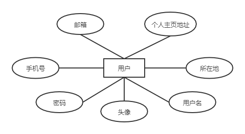
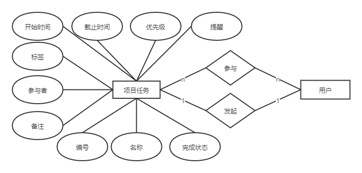
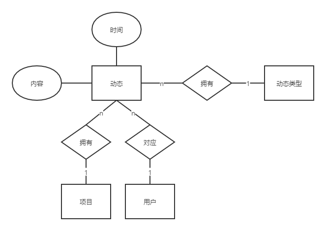

参考文档：[点这里](https://wenku.baidu.com/view/fcccbc33168884868662d625.html)
实际例子：[点这里](https://wenku.baidu.com/view/0176e7eb856a561252d36f56.html)

# 目录
- 1 引言
    - 1.1 编写目的
    - 1.2 背景
    - 1.3 定义
    - 1.4 参考资料
- 2 外部设计
    - 2.1 标识符和状态
    - 2.2 使用它的程序
    - 2.3 约定
- 3 结构设计
    - 3.1 概念结构设计
    - 3.2 逻辑结构设计
- 4 运用设计
    - 4.2 安全保密设计

# 1 引言

## 1.1 编写目的
1、本数据库设计说明书旨在详细描述轻量级团队协作办公解决方案“17”中的数据库结构和设计，包括逻辑结构设计、数据字典设计、安全保密设计等，清晰明确并结构化地将本项目系统的数据库结构和设计方案传递给相关项目参与人员，加深开发者对项目的了解程度，并且可以有助于尽早发现和减少项目的需求错误，帮助成员更好的融入到项目中。

2、本数据库设计说明书读者：用户、系统设计人员、系统测试人员、系统维护人员。

3、本数据库设计说明书是系统详细设计、用户验收的依据之一。

## 1.2 背景
近几年在线协作变得流行，各大厂商纷纷把工作转移至云端，让用户真正可以随时随地不受设备限制地处理任何工作，还可以实时协作，这种趋势对办公场景下的效率提升是很有帮助的。2020年突如其来的疫情使手机、互联网在生活工作中成为了我们最重要的东西。在这样的大环境下，线上工作的重要性尤为突出。本项目是名为《17》，是一款轻量级团队在线协作项目，提出和开发团队均为2017级福州大学软件工程的一根藤上七朵花小组，主要用户为有线上办公协作需求的人群。

## 1.3 定义
本文用到的术语符合国家标准《软件工程术语（GB/T11475-1995）》。

## 1.4 参考资料
本文的参考资料如下：

[数据库设计说明书](https://wenku.baidu.com/view/1965b66a0029bd64793e2c7a.html)

# 2 外部设计

## 2.1 标识符和状态
数据库软件的名称：Mysql5.7

数据库的名称：DB-17

## 2.2 使用它的程序
本数据使用于“17”的后端软件

## 2.3 约定

### 2.3.1 数据库命名约定

1.表名

+ 记录单一信息的数据库表以本表所记录的信息为名，为单个英文单词。例如用户表为User，项目名为Project。
+ 负责两表的连接工作的表以两表的表名组合连接为名，为两个英文单词。例如项目参与表ProjectUser。

2.数据字段名

+ 记录本表专用的属性以本属性的同义英文单词为名。
+ 时间类的属性以t_开头，后接时间的专属意义单词。例如任务开始时间t_begin。

### 2.3.2 数据库设计约定

在本系统中，数据库的设计采用面向对象的设计方法，首先进行对象实体的设计，最后将对象持久化到数据库中。

# 3 结构设计

## 3.1 概念结构设计
### 1. 用户模块

#### 1.1用户信息

用户信息（账号、头像、用户名、密码、所在地、个人主页地址、邮箱号、手机号）

---

### 2. 项目模块

#### 2.1 项目任务

项目任务（项目编号、项目名称、参与者、发起人、开始时间、截止时间、优先级、状态、标签、提醒、备注信息）

属性约束：

+ 优先级：普通=0、紧急=1、非常紧急=2

  

标签（名称、编号）

#### 2.2 人员信息

人员信息（参与者、动态）

动态（编号、时间、头像、账号、类型、用户名）

类型（修改任务、回复、加入任务、完成任务、取消任务、创建任务、退出任务、发布消息）

属性约束：

+ 类型：创建任务=1，删除任务=2，取消任务=3，修改任务=4，加入任务=5，退出任务=6，回复=7，发布消息=8

实体关联约束：

+ 一个人员可以发布多条动态，一个动态仅由一人发布。
+ 一个类型可以有多个被动态拥有，一个动态仅有一种类型。

---

### 3.功能模块

#### 3.1 日程安排

日程（编号，内容，标签，提醒时间，设置时间，备注）

#### 3.2 文件管理

文件管理（文件编号、创建者、大小、名称、所在位置、更新时间）

#### 3.3 文件协作

文件协作（记录）

#### 3.4 群组

群组(编号)

实体关联约束：

+ 项目成员可以划分成多个可重复的群组，一个群组可以由多个项目成员构成。
+ 一个群组有多条聊天记录，每条记录由一个组内成员发表

#### 3.5 提醒

提醒（时间、提醒对象）

 实体关联约束：

+ 一个提醒可以作用于多个对象，一个对象可以被多个提醒作用。

---

## 3.2 逻辑结构设计
#### 1.用户表（User）记录用户的个人信息

| 字段名     | 数据类型  | 长度 | 主键 | 允许空值 | 描述               |
| ---------- | --------- | ---- | ---- | ---- | ------------------ |
| id         | int       |      | 是   | 否   | 用户编号   |
| name       | varchar   | 100  |      | 否   | 用户名             |
| password   | char   | 128  |      | 否   | 密码（加密后入表） |
| photo      | varchar   | 200  |      |      | 头像url地址        |
| location   | varchar   | 500  |      |      | 所在地             |
| website    | varchar   | 200  |      |      | 个人主页地址       |
| email  | varchar  | 50   |      |      | 邮箱 |
| tel    | char  | 11   |      |      | 电话 |
| t_create | timestamp |      |      |      | 创建时间           |
| t_update | timestamp |      |      |      | 更新时间           |
| t_delete | timestamp |      |      |      | 删除时间           |

#### 2.项目表（Project）记录每个项目的信息

| 字段名     | 数据类型  | 长度 | 主键 | 允许空值 | 描述                            |
| ---------- | --------- | ---- | ---- | ---- | ------------------------------- |
| id        | int       |      | 是   | 否   | 项目编号 |
| name       | varchar   | 100  |      | 否   | 项目名                          |
| user_id   | int       |      |      |      | 创建人                        |
| t_create | timestamp |      |      |      | 创建时间                        |
| t_update | timestamp |      |      |      | 更新时间                        |
| t_delete | timestamp |      |      |      | 删除时间                        |

#### 3.项目参与表（ProjectUser）记录项目和参与者的对应关系

| 字段名   | 数据类型  | 长度 | 主键 | 允许空值 | 描述     |
| -------- | --------- | ---- | ---- | ---- | -------- |
| project_id      | int       |      | 是   | 否   | 项目编号 |
| user_id      | int       |      | 是   | 否   | 用户编号 |
| identity | tinyint   |      |      |    否  | 身份     |
| t_attend | timestamp |      |      |      | 加入时间 |
| t_delete | timestamp |      |      |      | 删除时间                        |

#### 4.任务表（Task）记录每个任务的信息

| 字段名     | 数据类型  | 长度 | 主键 | 允许空值 | 描述                            |
| ---------- | --------- | ---- | ---- | ---- | ------------------------------- |
| id        | int       |      | 是   | 否   | 任务编号                       |
| name       | varchar   | 100  |      | 否   | 项目名                          |
| remarks    | text      |      |      |      | 任务备注                            |
| completion | bool      |      |      |否     |完成情况                         |
| user_id   | int       |      |      |      | 发起人id                        |
| t_begin    | timestamp |      |      |      | 开始时间                        |
| t_end      | timestamp |      |      |      | 截止时间                        |
| priority   | tinyint   |      |      |      | 优先级                          |
| warn       | tinyint   |      |      |      | 提醒编号                        |
| label      | text      |      |      |      | 标签                         |
| t_create | timestamp |      |      |      | 创建时间                        |
| t_update | timestamp |      |      |      | 更新时间                        |
| t_delete | timestamp |      |      |      | 删除时间                        |

#### 5.任务参与表（TaskUser）记录项目和参与者的对应关系

| 字段名   | 数据类型  | 长度 | 主键 | 允许空值 | 描述     |
| -------- | --------- | ---- | ---- | ---- | -------- |
| task_id      | int       |      | 是   | 否   | 项目编号 |
| user_id      | int       |      | 是   | 否   | 用户编号 |
| t_attend | timestamp |      |      |      | 加入时间 |

#### 6.标签表（Label）记录标签信息

| 字段名 | 数据类型 | 长度 | 主键 | 允许空值 | 描述     |
| ------ | -------- | ---- | ---- | ---- | -------- |
| id    | int      |      | 是   | 否   | 标签id  |
| project_id    | int      |      |      |否    |项目id|
| name   | varchar  | 20   |      |      | 标签名称 |

#### 7.群组表(Group)
| 字段名 | 数据类型 | 长度 | 主键 | 允许空值 | 描述             |
| ------ | -------- | ---- | ---- | ---- | ---------------- |
| id    | int      |      | 是   | 否   | 群组编号 自增gid |
| name   | varchar  | 20   |      |否    | 群组名|
| is_all   | bool     |      |      | 否   | 是否为全员群 |
| user_id    | int      |      |    | 否   | 群组创建人编号     |
| t_create | timestamp |      |      |      | 创建时间                        |
| t_update | timestamp |      |      |      | 更新时间                        |
| t_delete | timestamp |      |      |      | 删除时间                        |

#### 8.群组成员表(GroupUser)
| 字段名 | 数据类型 | 长度 | 主键 | 允许空值 | 描述             |
| ------ | -------- | ---- | ---- | ---- | ---------------- |
| group_id    | int      |      | 是   | 否   | 群组编号 自增gid |
| user_id    | int      |      |    | 否   | 成员编号    |
| project_id  | int      |      |    | 否   | 项目编号    |
| t_attend | timestamp |      |      |      | 加入时间                        |
| t_delete | timestamp |      |      |      | 删除时间                        |

#### 9.聊天记录表(GroupChatRecord)
| 字段名 | 数据类型 | 长度 | 主键 | 允许空值 | 描述             |
| ------ | -------- | ---- | ---- | ---- | ---------------- |
| group_id    | int      |      | 是   | 否   | 群组编号 自增gid |
| user_id    | int      |      |    | 否   | 发送者编号    |
| context | text     |      |      | 否   |发送内容|
| t_create | timestamp |      |      |      | 创建时间        |

#### 10.动态表（Action）记录参与者的动态信息

| 字段名  | 数据类型  | 长度 | 主键 | 允许空值 | 描述               |
| ------- | --------- | ---- | ---- | ---- | ------------------ |
| id     | int       |      | 是   | 否   | 动态编号 自增aid   |
| user_id | int       |    |      | 否   | 发布动态的用户编号 |
| project_id  | int   |    |     |  否    | 所在项目  |
| time    | timestamp |      |      |      | 发布时间           |
| type_id     | tinyint   |      |      |      | 动态类型id           |
| content | varchar   | 200  |      |      | 动态内容           |

#### 11.动态类型表（ActionType）记录参与者的动态信息

| 字段名  | 数据类型  | 长度 | 主键 | 允许空值 | 描述               |
| ------- | --------- | ---- | ---- | ---- | ------------------ |
| id     | int       |      | 是   | 否   | 动态编号 自增aid   |
| name    | varchar   | 20   |     |  否   |  动态名称   |
| content | varchar   | 200  |      |   否   | 动态描述           |

#### 12.日程表（Schedule）记录用户的日程安排

| 字段名   | 数据类型  | 长度 | 主键 | 允许空值 | 描述             |
| -------- | --------- | ---- | ---- | ---- | ---------------- |
| id      | int       |      | 是   | 否   | 日程编号 自增sid |
| content  | varchar   | 500  |      |      | 内容             |
| user_id     | int       |      |      | 否   | 发布用户编号         |
| remarks  | varchar   | 500  |      |      | 备注             |
| label    | text      |      |      |      | 标签|
| t_remind | timestamp |      |      |      | 提醒时间         |
| t_set    | timestamp |      |      |      | 设置时间         |
| t_create | timestamp |      |      |      | 创建时间                        |
| t_update | timestamp |      |      |      | 更新时间                        |
| t_delete | timestamp |      |      |      | 删除时间                        |

#### 13.提醒表（Remind）记录用户提醒信息

| 字段名 | 数据类型  | 长度 | 主键 | 非空 | 描述             |
| ------ | --------- | ---- | ---- | ---- | ---------------- |
| id    | int       |      | 是   | 否   | 提醒编号 |
| user_id    | int       |      |    | 否   | 提醒用户编号     |
| peoject_id    | int       |      |    | 否   | 所属项目编号     |
| time   | timestamp |      |      |      | 提醒时间         |
| template_id    | int       |      |      | 否   | 提醒模板   |
| content| text      |      |      | 否   | 提醒内容   |
| t_create | timestamp |      |      |      | 创建时间                        |
| t_update | timestamp |      |      |      | 更新时间                        |
| t_delete | timestamp |      |      |      | 删除时间                        |

#### 14.提醒模板(RemindTemplate)
| 字段名 | 数据类型  | 长度 | 主键 | 非空 | 描述             |
| ------ | --------- | ---- | ---- | ---- | ---------------- |
| id    | int       |      | 是   | 否   | 提醒编号 |
| content| text      |      |      | 否   | 提醒内容   |

#### 15.文件管理表（File）记录文件情况

| 字段名   | 数据类型  | 长度 | 主键 | 非空 | 描述             |
| -------- | --------- | ---- | ---- | ---- | ---------------- |
| id      | int       |      | 是   | 否   | 文件编号 自增fid |
| user_id  | int   |   |      |      | 文件创建者       |
| name     | varchar   | 100  |      |      | 文件名           |
| location | varchar   | 200  |      |      | 文件所在位置     |
| size     | double    |      |      |      | 文件大小         |
| t_create | timestamp |      |      |      | 创建时间                        |
| t_update | timestamp |      |      |      | 更新时间                        |
| t_delete | timestamp |      |      |      | 删除时间                        |

#### 15.文件修改(FileUpdate)记录

| 字段名   | 数据类型  | 长度 | 主键 | 非空 | 描述             |
| -------- | --------- | ---- | ---- | ---- | ---------------- |
| id      | int       |      | 是   | 否   | 记录id |
| file_id  | int   |   |      |      | 文件id       |
| user_id  | int   |   |      |      | 修改人       |
| t_update | timestamp |      |      |      | 更新时间                        |

# 4 运用设计

## 4.1 安全保密设计

### 4.1.1 访问安全

用户只能与后端应用进行交互，后端应用再访问数据库，用户无法直接接触数据库。

### 4.1.2 角色权限

根据表的作用不同，需要设计角色权限符合以下需求

面向实际用户的程序所使用的角色：

|表名|SELECT|CREATE|UPDATE|DELETE|
|:---:|:---:|:---:|:---:|:---:|
|User|✔|✔|✔|软删除|
|Project|✔|✔|✔|软删除|
|ProjectUser|✔|✔|✔|软删除|
|Task|✔|✔|✔|软删除|
|TaskUser|✔|✔|✔|✔|
|Label|✔|✔||✔|
|Group|✔|✔|✔|软删除|
|GroupUser|✔|✔||软删除|
|GroupChatRecord|✔|✔|||
|Action|✔|✔|||
|ActionType|✔||||
|Schedule|✔|✔|✔|软删除|
|Remind|✔|✔|✔|软删除|
|RemindTemplate|✔||||
|File|✔|✔|✔|软删除|
|FileUpdate|✔|✔|||

面向系统维护人员后台管理的程序所使用的角色，在下表的权限有所不同外，其余权限与上表权限相同：

|      表名      | SELECT | CREATE | UPDATE | DELETE |
| :------------: | :----: | :----: | :----: | :----: |
|   ActionType   |   ✔    |   ✔    |   ✔    |        |
| RemindTemplate |   ✔    |   ✔    |   ✔    |        |

- 注: 软删除指的是删除时不删除记录，而是在记录的删除时间列中填写删除时间以表示删除。

### 4.1.3  数据安全

#### 1. 数据保密性

​数据保密性服务是针对信息泄漏而采取的防御措施，包括信息保密、选择段保密、业务流保密等内容。例如用户的密码需要进行哈希加密后存入数据库，防止用户密码明文泄露。

#### 2. 数据完整性

​数据完整性服务包括防止非法篡改信息，如修改、删除、插入、复制等。防止有关用户的项目进度数据在网络上传输时被破坏，或者是对于数据库中表数据的破坏。

