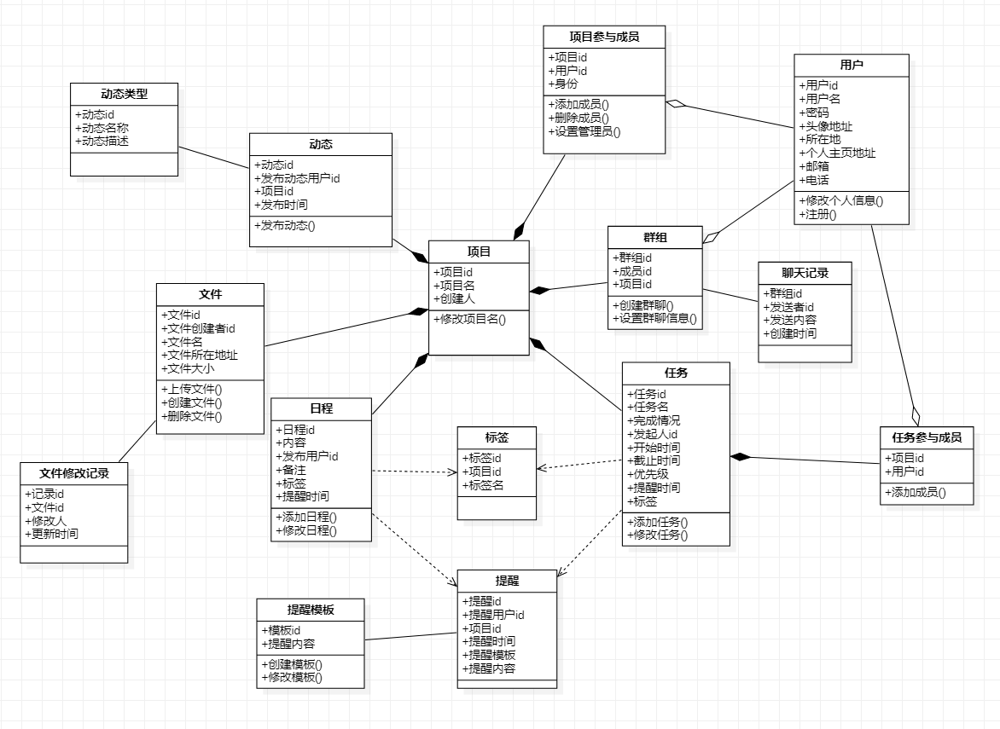

# 目录
- 1 引言
    - 1.1 系统概述
    - 1.2 文档概述
- 2 系统总体设计
    - 2.1 开发概述
    - 2.2 开发环境
    - 2.3 部署环境
    - 2.4 运行环境
- 3 系统功能概述
    - 3.1 系统需求概述
    - 3.2 系统模块概述
    - 3.3 系统类图
- 4 系统模块详细设计
    - 4.1 用户模块
    - 4.2 项目模块
    - 4.3 项目任务模块
    - 4.4 项目日程模块
    - 4.5 项目文件模块
    - 4.6 提醒模块
    - 4.7 项目群聊模块

# 1 引言

## 1.1 系统概述

 近几年在线协作变得流行，各大厂商纷纷把工作转移至云端，让用户真正可以随时随地不受设备限制地处理任何工作，还可以实时协作，这种趋势对办公场景下的效率提升是很有帮助的。2020年突如其来的疫情使手机、互联网在生活工作中成为了我们最重要的东西。在这样的大环境下，线上工作的重要性尤为突出。本系统是名为《17》，是一款轻量级团队在线协作项目，提出和开发团队均为2017级福州大学软件工程的一根藤上七朵花小组，主要用户为有线上办公协作需求的人群。

## 1.2 文档概述

 本文档阐述了该系统的结构和功能设计，用于帮助开发者更快地熟悉并开发系统。

# 2 系统总体设计

## 2.1 开发概述

 系统采用前后端分离的方式开发。
 前端需按照接口文档中所定义的访问方式，正确访问后端所提供的接口，后端的每次响应除了返回所请求的数据外还需要返回本次请求状态成功与否的状态码和具体信息。
 
## 2.2 开发环境

- 前端
    - vue-cli
    - ant-design
    
- 后端
    - Python Flask
    - Mysql
    - Redis

## 2.3 部署环境

 

 - Nginx: 高性能的HTTP和反向代理服务器
 - SPA:只有一张Web页面（index.html）的应用，通过前端组织各种资源的调度来实现传统的页面切换。
 - WSGI:Web服务器网关接口
 - Flask:Python Web应用框架
 
## 2.4 运行环境

 本系统支持运行在Windows和主流Linux系统上。

# 3 系统功能概述

## 3.1 系统需求概述

 该系统以项目为基础单位，追踪、展示项目的工作进度，集各种项目管理功能集一身的信息系统，其中以项目任务管理、项目日程管理、项目文件管理为核心功能。
 
## 3.2 系统模块概述

 将系统的各功能分为以下几个模块:
 
 - 用户模块: 处理用户的登录、注册、修改信息等用户个人操作功能。
 
 - 项目基础管理模块： 处理项目的创建、修改信息、人员调整等项目基础管理功能。
 
 - 项目任务模块： 处理任务的创建、分配、查看等任务管理功能。
 
 - 项目日程模块： 处理日程的创建、查看等任务管理功能。
 
 - 项目文件模块： 处理用户上传、下载、修改、协作修改项目文件的功能。
 
 - 提醒模块： 处理各部分模块需要发送消息提醒用户的功能。
 
 - 项目群聊模块：处理项目内多人聊天的功能。
 
 - 其他模块： 其他优化用户体验的功能。

## 3.3 系统功能类图

 
# 4.系统模块详细设计

## 4.1 用户模块

### 4.1.1 模块描述

处理用户的登录、注册、修改信息等用户个人操作功能。

### 4.1.2 功能描述

 1. 注册
    - 功能描述：用户通过输入相应信息，创建一个新账户。
    - 输入数据：邮箱地址或手机号、密码、用户名
    - 返回信息：若注册失败需返回相应信息。
   
 2. 账密登录
    - 功能描述：用户可以选择输入邮箱地址或用户名，然后填写密码，进行登录。
    - 输入数据：邮箱地址或用户名、密码
    - 返回信息：若登录失败需返回相应信息。登录成功会返回该用户所对应的session用于验证身份。
    
 3. 手机号登录
    - 功能描述：用户输入手机号，在获取手机短信验证码后，输入验证码进行登录。
    - 输入数据：手机号、短信验证码
    - 返回信息：若登录失败需返回相应信息。登录成功会返回该用户所对应的session用于验证身份。
    
 4. 修改密码
    - 功能描述：用户登录后，输入旧密码和新密码来更改密码
    - 输入数据：旧密码、新密码
    - 返回信息：旧密码不正确或新密码不符合规则需要返回相应提示
    
 5. 修改信息
    - 功能描述：用户登录后，输入需要修改的信息，进行修改。
    - 输入数据：需要修改的信息
    - 返回信息：新信息的合法性

 6. 查找用户
    - 功能描述：通过用户名或邮箱或手机号查找用户的信息
    - 输入数据：用户名或邮箱或手机号
    - 返回信息：若用户存在返回编号、头像、用户名
    
 7. 查看用户
    - 功能描述：通过用户编号查看用户信息
    - 输入数据：用户编号
    - 返回信息：若用户存在返回头像、个人主页、所在地、用户名等可公开信息
    

### 4.1.3 相关UML图

## 4.2 项目基础管理模块

### 4.2.1 模块描述

处理项目的创建、修改信息、人员调整等项目基础管理功能。

### 4.2.2 功能描述
 1. 创建项目
    - 功能描述：用户登录后，可以通过一个简单的创建面板快速创建新的项目
    - 输入数据：项目名、项目相关信息
    - 返回信息：项目创建是否成功的提示
    
 2. 添加成员
    - 功能描述：用户登录后，项目的创建者或管理员对该项目添加成员
    - 输入数据：项目编号、添加的成员编号(编号可在用户模块中查询)
    - 返回信息：邀请成功与否的信息
    
 3. 删除成员
    - 功能描述：用户登录后，项目的创建者或管理员对该项目删除成员
    - 输入数据：项目编号、删除的成员编号(编号可在用户模块中查询)
    - 返回信息：删除成功与否的信息
    
4. 设置管理员
    - 功能描述：用户登录后，项目的创建者对该项目设置或取消管理员
    - 输入数据：项目编号、用户编号(编号可在用户模块中查询)、是否为管理员
    - 返回信息：设置成功与否的信息

### 4.2.3 相关UML图

## 4.3 项目任务模块

### 4.3.1 模块描述

处理任务的创建、分配、查看等任务管理功能。

### 4.3.2 功能描述

1. 添加任务
    - 功能描述：用户登录后，项目成员可对该项目添加新的任务
    - 输入数据：项目编号、新的任务信息
    - 返回信息：新任务发布成功与否的信息
    
2. 修改任务
    - 功能描述：用户登录后，项目成员可对该项目设置任务信息，包括完成状态等信息
    - 输入数据：项目编号、任务编号、任务信息
    - 返回信息：设置成功与否的信息
    
3. 查看任务列表
    - 功能描述：用户登录后，可查看所在项目所有的任务的简要信息
    - 输入数据：项目编号
    - 返回信息：任务简要信息列表
    
4. 查看任务详细信息
    - 功能描述：用户登录后，可查看所在项目的某个任务的详细信息
    - 输入数据：项目编号、 任务编号
    - 返回信息：任务详细信息
    

### 4.3.3 相关UML图

## 4.4 项目日程模块

### 4.4.1 模块描述

处理日程的创建、查看等任务管理功能。

### 4.4.2 功能描述

1. 添加日程
    - 功能描述：用户登录后，项目成员可对该项目添加新的日程
    - 输入数据：项目编号、新的日程信息
    - 返回信息：新日程发布成功与否的信息
    
2. 修改日程
    - 功能描述：用户登录后，项目成员可对该项目设置日程信息
    - 输入数据：项目编号、日程编号、日程信息
    - 返回信息：设置成功与否的信息
    
3. 查看日程列表
    - 功能描述：用户登录后，可查看所在项目所有的日程的简要信息
    - 输入数据：项目编号
    - 返回信息：日程简要信息列表
    
4. 查看日程详细信息
    - 功能描述：用户登录后，可查看所在项目的某个日程的详细信息
    - 输入数据：项目编号、 日程编号
    - 返回信息：日程详细信息
    
### 4.4.3 相关UML图

## 4.5 项目文件模块

### 4.5.1 模块描述

处理文件的上传、创建和修改等任务管理功能。

### 4.5.2 功能描述
1. 上传文件或创建文件夹
    - 功能描述：用户登录后，项目成员可对该项目添加新的文件或文件夹
    - 输入数据：项目编号、新的文件信息
    - 返回信息：上传或创建成功与否的信息

2. 删除文件
    - 功能描述：用户登录后，项目成员可对该项目的文件进行删除
    - 输入数据：项目编号、文件编号
    - 返回信息：删除成功与否的信息
    
3. 查看文件列表
    - 功能描述：用户登录后，可查看所在项目所有的文件的存储信息以及总存储空间
    - 输入数据：项目编号
    - 返回信息：文件列表
    
4. 查看文件修改记录
    - 功能描述：用户登录后，可查看所在项目的所有文件的上传、修改或删除记录
    - 输入数据：项目编号
    - 返回信息：所有文件的上传、修改或删除记录

5. 文档协作
    - 功能描述：用户登录后，可对所在项目的文档文件进行共同协作
    - 输入数据：项目编号、文件编号
    - 返回信息：是否运行协作以及其他支持该功能运作的信息

### 4.5.3 相关UML图

## 4.6 提醒模块

### 4.6.1 模块描述

处理各部分模块需要发送消息提醒用户的功能

### 4.6.2 功能描述

1. 获取验证码
    - 功能描述：获取短信验证码用于用户手机号登录或注册等情况
    - 输入数据：手机号
    - 返回信息：短信发送成功与否的提示
    
2. 发送提醒
    - 功能描述：各功能模块需要对用户进行消息提醒，如网站内提醒、短信提醒、邮件提醒等均可使用此功能
    - 输入数据：提醒用户编号、提醒类型、提醒内容、提醒模板、提醒时间
    - 返回信息：提醒设置成功与否的提示
    
3. 修改未发送提醒
    - 功能描述：对各功能模块的消息提醒进行修改
    - 输入数据：提醒编号、修改的提醒信息
    - 返回信息：提醒修改成功与否的提示
    
### 4.6.3 相关UML图

## 4.7  项目群聊模块

### 4.7.1 模块描述

处理项目内多人聊天的功能。

### 4.7.2 功能描述
1. 创建群聊
    - 功能描述：用户登录后，可在项目内选择指定成员创建一个群聊，此时群聊将会以群组的形式创建，各相关功能均以群组为基本单位。项目在创建时会创建一个全员群聊，该群聊无法被修改。
    - 输入数据：群聊名、群聊成员
    - 返回信息：群聊创建成功与否的提示

2. 进行群聊
    - 功能描述：用户登录后，可在群组内进行群聊
    - 输入数据：群组编号
    - 返回信息：群聊聊天记录等信息
    
3. 设置群聊信息
    - 功能描述：用户登录后，群聊创建者可对该群组进行信息和人员的修改
    - 输入数据：群组编号、修改的信息
    - 返回信息：修改成功与否等信息

### 4.7.3 相关UML图

## 4.8  其他模块

### 4.8.1 模块描述

其他增加用户体验的功能

### 4.8.2 功能描述

1. 动态
    - 功能描述：查看用户各功能的使用记录
    
2. 通知
    - 功能描述：提醒用户尚未完成的事项

